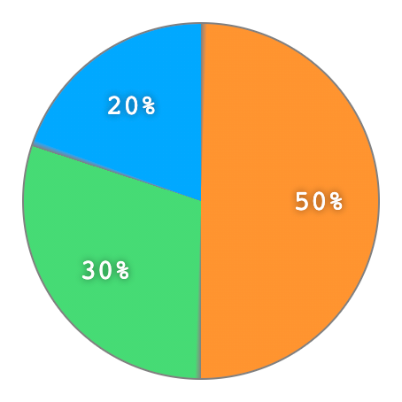

# PieChart-Component

PieChart-Component is a simple ReactJS component designed to render simple Pie Charts (circular statistical graphics).

It was implemented for didactic reasons, therefore it is not yet ready for production (see [Next steps](#next-steps) section below).

The following snippet/screenshot presents the basic usage:

```
<PieChart
  radius={100}
  separatorColor="#808080"
  separatorDegree={2}
  showValues={false}
  showPercentages={true}
  data={[
    { color: "#FF9430", value: 5 },
    { color: "#46DB75", value: 3 },
    { color: "#00A9FF", value: 2 },
  ]}
/>
```



## Instructions to run

It uses [Storybook](https://storybook.js.org/) tool for UI development (since it does not contain a standalone application), so basically:

```
git clone https://github.com/samereberlin/PieChart-Component.git
cd PieChart-Component
npm i
npm run storybook
```

## Next steps

The component still needs a lot of adjustments to reach the production level, and the list below presents the main/urgent needs according to my feeling...

- Replace CSS solution with a more robust SVG drawing, in order to allow effects such as hovering and click feedback.

- Write unit-tests and end-to-end tests (at least to cover basic functionalities).

- Improve rendering of discrepant values (e.g. 97%, 2%, 1%), maybe by increasing the `distanceFromCenter` value in case of low percentage. Suggestion:

```
// Replace the line...
const distanceFromCenter = radius / 1.5;

// with something like...
const distanceFromCenter = radius / (percentages[idx] < 0.1 ? 1.2 : 1.5);

// or even better...
const lowPercentage = percentages[idx] < 0.1;
const distanceFromCenter = radius / (lowPercentage ? 1.2 : 1.5);
const style = lowPercentage ? { fontSize: '0.8em' } : {};
...
<div className={styles.text} style={style}>
```

- Add the possibility of rendering a 1 pixel tick border-line between the pie-pieces (from the center to the arc) instead of using separatorDegree, maybe using a simple div with the appropriated rotating angle. Suggestion:

```
// Add new DIVs into the pie (1 per each item),
// and render it in the pie-piece starting angle using a css like:
element.style {
    position: absolute;
    top: 100px;
    left: 100px;
    border-width: 2px 0 0 0;
    border-color: black;
    border-style: solid;
    width: 100px;
    transform: rotate(-90deg) rotate(90deg);
    transform-origin: top left;
}
```
